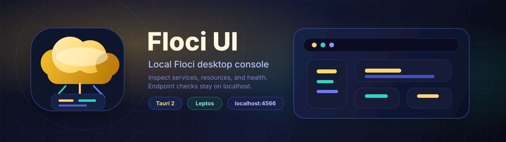

# Floci UI



[](LICENSE)
[](rust-toolchain.toml)
[](https://tauri.app/)

Floci UI is a Rust desktop app for inspecting a local
[Floci](https://github.com/floci-io/floci) AWS-compatible emulator. It is built
with Tauri 2, a Leptos CSR frontend compiled by Trunk, Tailwind CSS, and a Rust
native backend that owns emulator connectivity.

This project targets local development and local emulator workflows. It is not a
general AWS console replacement, and it intentionally refuses non-local endpoint
hosts for `FLOCI_AWS_ENDPOINT_URL`.

## Features

- Desktop shell powered by Tauri 2.
- Leptos CSR frontend with Trunk and Tailwind CSS.
- Local Floci health checks through `/_floci/health`.
- Service catalog and inventory commands exposed through the Tauri boundary.
- AWS SDK based adapters for local emulator service inspection.
- Endpoint safety checks that allow loopback and local emulator aliases only.

## Architecture

The app is split into two Rust targets:

- `src/`: Leptos frontend compiled to WASM and served by Trunk.
- `src-tauri/`: native Tauri backend that reads local configuration, validates
  endpoint safety, calls Floci, and exposes commands to the frontend.

The npm package is intentionally `"private": true` because npm is used for
frontend build tooling, not for publishing a JavaScript library.

See [docs/architecture.md](docs/architecture.md) for the command boundary,
service adapter model, and local endpoint safety details.

## Requirements

- Rust 1.95.0, managed by [rust-toolchain.toml](rust-toolchain.toml).
- `wasm32-unknown-unknown` Rust target.
- [Trunk](https://github.com/trunk-rs/trunk).
- Node.js and npm for Tailwind CSS.
- Tauri 2 CLI and platform prerequisites.
- Docker, if you want to run Floci locally through Compose.

## Setup

PowerShell:

```powershell
Copy-Item .env.example .env
rustup target add wasm32-unknown-unknown
cargo install trunk
cargo install tauri-cli --version "^2.0"
npm install
```

POSIX shell:

```sh
cp .env.example .env
rustup target add wasm32-unknown-unknown
cargo install trunk
cargo install tauri-cli --version "^2.0"
npm install
```

## Run With Floci

Start the emulator:

```powershell
docker compose up -d floci
```

Then run the desktop app:

```powershell
cargo tauri dev
```

Tauri starts the npm frontend workflow, which runs Tailwind CSS and Trunk on:

```text
http://localhost:1420
```

By default the native backend checks:

```text
http://localhost:4566/_floci/health
```

## Configuration

| Variable                 | Default                 | Purpose                                            |
| ------------------------ | ----------------------- | -------------------------------------------------- |
| `FLOCI_AWS_ENDPOINT_URL` | `http://localhost:4566` | Local Floci endpoint                               |
| `FLOCI_AWS_REGION`       | `us-east-1`             | Region shown by the UI and used by AWS SDK clients |
| `AWS_ACCESS_KEY_ID`      | `test`                  | Local emulator access key                          |
| `AWS_SECRET_ACCESS_KEY`  | `test`                  | Local emulator secret key                          |

For safety, `FLOCI_AWS_ENDPOINT_URL` is restricted to loopback hosts and local
emulator aliases such as `localhost`, `127.0.0.1`, `[::1]`, `floci`,
`host.docker.internal`, `localhost.floci.io`, `*.localhost.floci.io`,
`localhost.localstack.cloud`, and `*.localhost.localstack.cloud`.

Do not point Floci UI at production AWS endpoints. The app is designed for a
local AWS-compatible emulator.

## Development Checks

Run the frontend build:

```powershell
npm ci
npm run build
```

Run the CI-equivalent Rust formatting checks:

```powershell
cargo +1.95.0 fmt --all --check
cargo +1.95.0 fmt --manifest-path src-tauri/Cargo.toml --all --check
```

Run backend tests, Clippy, and Tauri checks locally before larger backend or
native-shell refactors. For native-shell validation, you can also run the manual
`Tauri Check` GitHub Actions workflow. These checks are no longer part of the
default GitHub Actions gate to keep CI minutes focused on build and test signal.

## Troubleshooting

- If Trunk cannot build, verify the `wasm32-unknown-unknown` target is installed.
- If `cargo tauri dev` or `npm run dev` reports that port `1420` is already in
  use, stop the listed process first. Floci UI checks the port before starting
  but does not terminate existing listeners automatically.
- If Tauri cannot start on Linux, install the Tauri platform prerequisites for
  WebKit, GTK, and related system libraries.
- If the app rejects your endpoint, use a loopback URL or one of the supported
  local emulator aliases.
- If Docker cannot start Floci, check that port `4566` is free and Docker can
  mount `/var/run/docker.sock`.

More setup notes are in [docs/development.md](docs/development.md).

## Native Commands

The Tauri backend exposes:

- `floci_health` for the local Floci health endpoint.
- `service_catalog` for endpoint, region, credential status, and supported
  services.
- `service_inventory` for supported service resource lists.
- `service_resource_detail` for supported resource details.
- `service_execute_action` for supported local emulator resource actions.

## Contributing

Please read [CONTRIBUTING.md](CONTRIBUTING.md) before opening a pull request.
Security reports must follow [SECURITY.md](SECURITY.md) instead of public issues.
General support routing is documented in [SUPPORT.md](SUPPORT.md).

## License

Floci UI is licensed under the [MIT License](LICENSE).
